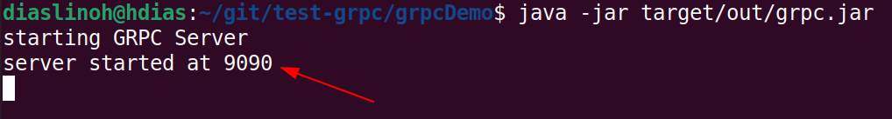
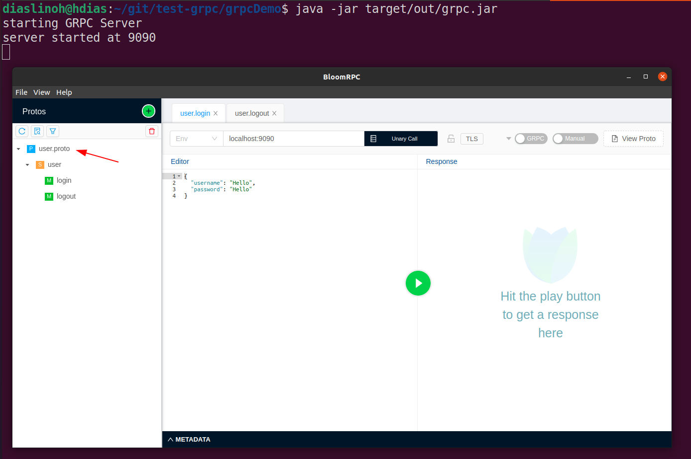
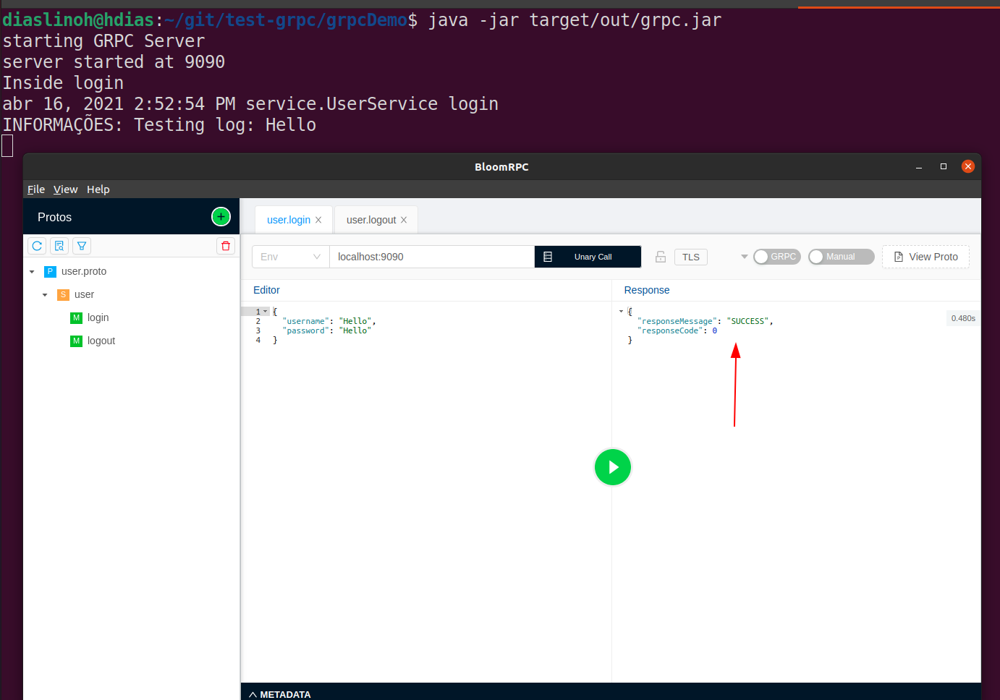

# test-grpc
Test GRPC in Java

# Requirements
* [Java >= 8](https://www.oracle.com/br/java/technologies/javase-jdk11-downloads.html)
* [Maven](https://maven.apache.org/download.cgi)
* [BloomRPC](https://appimage.github.io/BloomRPC/)

# How to Run
```
cd grpcDemo
mvn package
java -jar target/out/grpc.jar
```
**It should start the server at the port 9090.**

http://localhost:9090



Now use BloomRPC to import the "user.proto" file and test the server.

Path: [REPOSITORY]/grpcDemo/src/main/resources/**user.proto**






# References
* [SOURCE](https://github.com/yrreddy0123/yrrhelp)